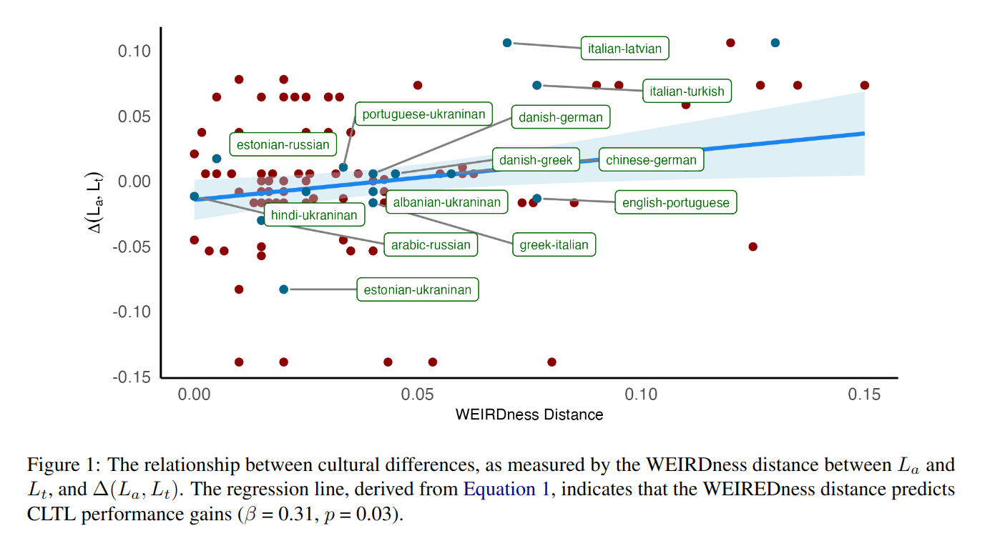
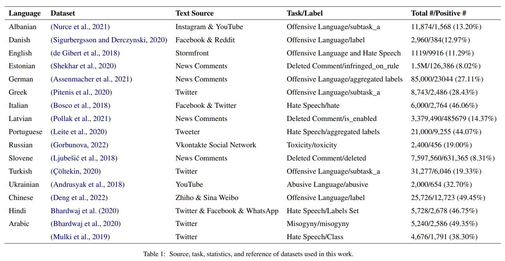

Source code for _**Cultural Diversity Enhances Offensive Language Detection in Multilingual Model**_

## Abstract
The proliferation of offensive content across diverse languages online necessitates culturally-aware NLP solutions. While Cross-Lingual Transfer Learning (CLTL) shows promise in other NLP tasks, its application to offensive language detection overlooks crucial cultural nuances in how offensiveness is perceived. This work investigates the effectiveness of CLTL for offensive language detection, considering both linguistic and cultural factors. Specifically, we investigated transfer learning across 105 language pairs, and uncovered several key findings. Firstly, training exclusively on English data may impede performance in certain target languages. Secondly, linguistic proximity between languages does not have a significant impact on transferability. Lastly, our study revealed a significant correlation between cultural distance and performance. Importantly, for each unit increase of cultural distance, there was an increase of 0.31 in the AUC. These findings emphasize the limitations of English-centric approaches and highlight the need to integrate cultural context into NLP solutions for offensive language detection.




## Table of Contents

1. [Setup](#setup)
2. [Replication](#replication)
4. [License](#license)
5. [Acknowledgements](#acknowledgements)

<a name="setup"></a>
## Setup

1. Clone this repository to your local machine:

    ```
    git clone <repository-url>
    ```

2. Navigate to the repository directory:

    ```
    cd <repository-directory>
    ```

3. Install the required dependencies by running:

    ```
    pip install -r requirements.txt
    ```
<a name="replication"></a>
## Replication

### Gathering the Data

First, download the data from the sources



### Running Experiments

To replicate the experiments, follow these steps:

1. Ensure you have the necessary environment set up as described above.

2. Open a terminal and navigate to the root directory of the repository.

3. Execute the provided script `run_experiments.sh`:

    ```bash
    cd scripts
    chmod +x acl_exp.sh
    ./acl_exp.sh
    ```

### Understanding the Script

The script `acl_exp.sh` automates the process of running experiments with different configurations. Here's what it does:

- It sets up different parameters such as GPUs to use, datasets, noise ratios, learning rates, etc., for each experiment configuration.

- It iterates through various combinations of parameters and runs the training script `train.py` for each configuration.

- Each experiment is run in a detached screen session, facilitating parallel execution.

### Customization

You can customize the experiments by modifying the script `acl_exp.sh`:

- Adjust the parameters in the script to suit your specific experiment setup.

### Relevant Parameters

Here are the relevant parameters used in the `train.py` script:

- `--TRAIN_BATCH_SIZE`: Training batch size.
- `--VALID_BATCH_SIZE`: Validation batch size.
- `--LEARNING_RATE`: Learning rate.
- `--EPOCHS`: Number of training epochs.
- `--LM`: pretrained language model to use.
- `--method`: Method used for training.
- `--dataset_name`: Dataset for training.
- `--label_col`: Label column name.
- `--balance`: Create a balanced dataset; default strategy is undersampling.
- `--balance_ratio`: Ratio of positive class in balanced experiments.
- `--warmup_ratio`: Ratio for linear scheduler warmup.
- `--weight_decay`: L2 regularization parameter used as weight decay param in AdamW.
- `--noise_ratio`: Ratio of training samples that will get their labels flipped.
- `--experiment_subdir`: Title of subdir for experiment, all models and logs will be written to this directory.
- `--seed`: Random seed for reproducibility.

### Notebooks

Use the notebook in [Post-Hoc Analysis Notebook](notebooks/post-hoc-analysis.ipynb) to generate the figures in the paper.
### License

This project is licensed under the [MIT License](LICENSE).

## Acknowledgements

....

